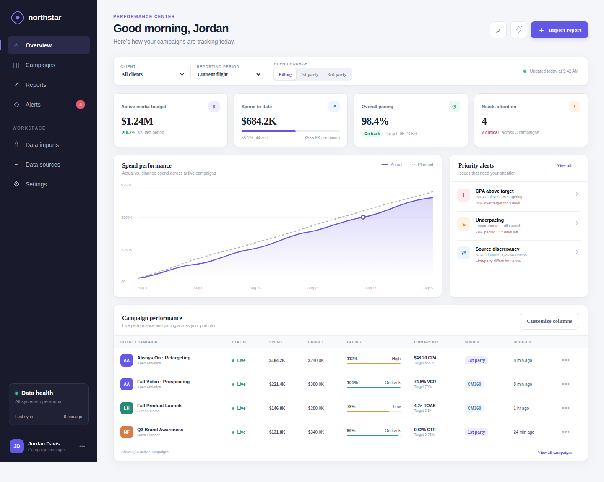

# Northstar campaign dashboard

A responsive, dependency-free dashboard prototype for monitoring client campaign performance, spend pacing, data-source discrepancies, and import health.



## Run locally

### Prerequisites

- Git
- Node.js with npm (use an employer-approved installation on managed devices)

Do not copy the Terminal prompt, Markdown link formatting, or angle brackets into these commands. On macOS, enter each command separately:

```bash
git clone https://github.com/zetastuckless-code/Dashbaord-tool.git
cd Dashbaord-tool
npm install
npm start
```

If the repository is already downloaded, start with `cd Dashbaord-tool`. If `node --version` or `npm --version` reports `command not found`, ask IT to install an approved Node.js release before continuing; the app depends on Vite and its Excel reader and cannot be run directly by double-clicking `index.html`.

If you downloaded a ZIP from GitHub, macOS normally extracts it under `~/Downloads` with a branch suffix. Locate and enter it with:

```bash
cd ~/Downloads
find . -maxdepth 1 -type d -iname 'Dashbaord-tool*' -print
cd Dashbaord-tool-main
```

Use the exact directory name printed by `find`; it may differ from `Dashbaord-tool-main`. Alternatively, type `cd ` (including the space), drag the extracted folder from Finder into Terminal, and press **Return**.

When the server starts, open <http://localhost:4173>. Stop it by returning to Terminal and pressing **Control-C**.

### Start an existing installation

```bash
npm start
```

Open <http://localhost:4173>.

## Functional alpha test pack

After the app starts, follow [`docs/alpha-test-guide.md`](docs/alpha-test-guide.md). The synthetic files in `templates/alpha/` exercise aliased first-party imports, third-party reconciliation, corrected reports, duplicate protection, rollback, invalid-data recovery, saved views, and workspace backup/restore without using client data.

Run the complete automated test and production-build check with:

```bash
npm run verify
```

## Test without installing software

The easiest managed-laptop option is GitHub Pages. A repository administrator enables **Settings → Pages → Source: GitHub Actions**, then runs the **Deploy dashboard to GitHub Pages** workflow (or merges to `main`). After deployment, testers only need a browser and can open:

<https://zetastuckless-code.github.io/Dashbaord-tool/>

The hosted alpha still stores campaigns and settings only in each tester's browser. Use the synthetic files under `templates/alpha/`; do not upload client data until the hosted location and browser-storage model are approved by your employer. GitHub Pages deployment runs the full verification command before publishing and includes the downloadable import and alpha templates.

### If the Pages workflow is not listed

GitHub only lists a manually runnable workflow after `.github/workflows/pages.yml` exists on the repository's default branch. First merge the pull request containing the Pages workflow into `main` (or otherwise add that file to the default branch). Then:

1. Open **Settings → Pages** and choose **GitHub Actions** as the source.
2. Open **Actions** and select **Deploy dashboard to GitHub Pages** in the workflow list.
3. Choose **Run workflow**, select `main`, and confirm **Run workflow**.

If the **Actions** tab, workflow, or **Run workflow** button is still unavailable, a repository or organization administrator must enable GitHub Actions and allow the Pages actions used by the workflow. The deployment also runs automatically on the next push to `main`, so the manual button is optional once the workflow is on that branch.

If the `main` branch contains only `.gitkeep`, the application has not been published to GitHub yet. A pull-request description by itself does not upload repository files. Do not enable Pages until the application files—including `package.json`, `index.html`, `app.js`, `lib/`, and `.github/workflows/pages.yml`—appear under **Code** on `main`. The project maintainer must first push this source branch to GitHub and merge it into `main`; after that merge, the Pages workflow will appear and run automatically. Creating another empty branch will not solve this condition.

### Publish the source for the first time

The build workflow does not push source code to GitHub. The order is **push source → GitHub runs the build → GitHub deploys the built site**. From a computer that has this complete project folder and Git installed, run these commands inside the project folder (Node.js is not required just to push):

If Terminal reports `fatal: not a git repository`, stop: the current folder is not a project checkout, and the commands below cannot retrieve files that have never been published. First download the complete source archive supplied by the project maintainer, unzip it, and enter the extracted folder. Confirm that `pwd` ends in that folder and that `git status` succeeds before continuing. A ZIP downloaded from the current `.gitkeep`-only GitHub `main` branch is not the application source.

A SHA-256 value shown beside a supplied download is only an optional integrity checksum—not a download key, password, command, or download location. A usable archive must be attached by the delivery system as an actual clickable file; displaying a filename or checksum in text does not transfer it. On macOS, a successfully downloaded archive can optionally be verified afterward with `shasum -a 256 <downloaded-file>`; the resulting value should match the published checksum exactly.

```bash
git remote add origin https://github.com/zetastuckless-code/Dashbaord-tool.git
git fetch origin
git merge origin/main --allow-unrelated-histories -m "Connect initial GitHub repository"
git push -u origin HEAD:main
```

If Git reports `remote origin already exists`, replace the first command with `git remote set-url origin https://github.com/zetastuckless-code/Dashbaord-tool.git`. The merge connects the local project history to the existing `.gitkeep` commit without deleting either history. Sign in through the browser or credential prompt using the GitHub account that owns the repository; never paste a password or access token into documentation or commit it to the project. If branch protection prevents a direct push, use a pull-request branch instead:

```bash
git push -u origin HEAD:dashboard-alpha
```

Then open the repository's **Pull requests** tab, create a pull request from `dashboard-alpha` into `main`, and merge it. Confirm the files are visible under **Code** on `main`; the Pages workflow should then start automatically under **Actions**.

## Prototype interactions

- Search campaigns by name, stable ID, owner, channel, or reporting source, then combine the search with client, owner, channel, and flight-status filters.
- Sort the filtered campaign table by pacing risk, selected-source spend, newest data, or campaign name without changing portfolio totals.
- Focus the portfolio on campaigns with unacknowledged alerts or campaigns that currently have no active exceptions; CSV exports use the same alert-status selection.
- Keep the active dashboard search, filters, sort, reporting period, and spend source across browser reloads, or restore the complete default portfolio with **Reset view**.
- Save up to ten named portfolio views, reopen their complete filter and KPI configuration, replace a view by saving the same name, or delete views that are no longer needed.
- Download a versioned JSON backup of the complete browser workspace—including campaigns, import history, alert settings, acknowledgments, columns, and dashboard filters—and restore it in another browser session only after validation succeeds.
- Reset only Northstar-owned browser data back to the included demo portfolio after testing, with a confirmation warning and without clearing unrelated website storage.
- Switch the campaign table between each campaign's configured primary KPI and centrally calculated CTR, VCR, CPA, or ROAS; unavailable component-based KPIs display as unavailable instead of using unrelated reported values.
- Review a portfolio-level KPI card calculated from the filtered live campaigns, with explicit data-coverage counts and a non-combined summary when campaigns use incompatible primary KPIs.
- Plot actual cumulative spend from retained dated report snapshots against flight-aware planned spend; the chart carries campaign totals forward between report dates and shows an explicit empty state until enough history exists.
- Rebuild the spend trend from billing, first-party, or third-party snapshot history when the dashboard spend-source control changes, without combining multiple reporting sources for one campaign.
- Compare actual and planned chart values over the same source-covered campaign set, and display the number of filtered campaigns contributing history so partial trend coverage is never hidden.
- Export the active portfolio spend trend to CSV with its source view, actual and planned spend, dollar variance, pacing percentage, and campaign-coverage counts for each date.
- Export the filtered campaign view to CSV with the selected spend source, calculated pacing, KPI, flight, source, and component metrics.
- Distinguish scheduled, live, and completed campaign flights; portfolio totals and alerts focus on live campaigns.
- Archive obsolete or test campaigns without deleting their audit history, exclude archived campaigns from operational totals and alerts, and restore them from the archived flight-status view.
- Switch between billing, first-party, and third-party spend views; summary and campaign totals recalculate immediately.
- Open **Import report**, select an Excel (`.xlsx`) or CSV file, review validation results and warnings without changing dashboard data, and explicitly confirm the validated import when it is ready.
- Preview how many campaigns will be added, updated, left unchanged, or removed before confirming an import; switching between merge and replacement modes recalculates the impact immediately without rereading the file.
- Undo the most recent confirmed import to restore campaign data and import history to their pre-import state; the reversal remains visible as a retained audit event and the reverted file can be corrected and imported again.
- Review every detected source column as directly supported, automatically aliased, or unmapped before import, and download the mapping review to CSV for template documentation and data-steward follow-up.
- Open the complete retained import audit, search by file, issue, status, or fingerprint, and filter successful, attention-required, and historical events without exporting to another tool.
- Select a campaign name to review imported components and every calculable KPI, or edit its dashboard display name, billing source, primary KPI, current value, and target.
- Add a versioned budget revision with an effective date, supporting document, and revision note.
- Review every budget revision newest-first and export the full audit—with previous and revised amounts, effective dates, supporting-document references, notes, and creation timestamps—to CSV.
- Create or update a single flight for each line item with its own start date, end date, and total allocated budget; saving the same line item ID updates its flight instead of duplicating the budget. The allocation summary shows assigned and remaining campaign budget and prevents line-item totals from exceeding the approved campaign budget.
- Export a campaign's line-item flight plan to CSV with campaign identity, line-item identity, dates, allocated budget, and the approved campaign budget for reconciliation or handoff.
- Remove obsolete line-item flights from campaign details; allocation totals and remaining budget recalculate immediately and the updated plan persists locally.
- Import a previously exported line-item flight CSV into the open campaign. Imports validate campaign identity, flight dates, and budget totals atomically before changing the saved plan.
- Review flight-aware campaign and portfolio pacing, expected spend, and projected final spend when start and end dates are available; reported pacing remains the fallback for reports without flight dates.
- Inspect imported impressions, clicks, conversions, revenue, and video metrics in campaign details, including calculated-versus-reported KPI traceability.
- Retain dated report snapshots during campaign merges and compare changes in spend, impressions, clicks, and conversions against the previous report or a selectable 7- or 30-day baseline from the same source; corrected same-date source reports replace their earlier snapshot.
- Review the ten newest dated snapshots for a campaign in its details and export the complete retained snapshot history—with campaign identity, source, spend, and component metrics—to CSV for audit or offline analysis.
- Bound browser snapshot retention to the latest 90 dated reports per source and campaign, preventing long-running imports from growing local storage indefinitely while preserving separate source histories.
- Switch the dashboard reporting period between current-flight totals and 7- or 30-day reported-source spend changes. Campaigns without enough dated history display an unavailable value instead of a misleading zero.
- Filter portfolio totals, campaign rows, alerts, and CSV exports by campaign owner and media channel; both values can be imported through common report headings or edited in campaign settings.
- Recalculate supported campaign-table KPIs from the selected period's component deltas so historical spend and KPI values use the same reporting window.
- Export the filtered dashboard with the active reporting period. Period exports identify reported-snapshot values explicitly, use period deltas for component metrics, recalculate supported KPIs from those deltas, and leave unavailable historical values blank.
- Configure underpacing, overpacing, first-party/third-party discrepancy, KPI-target tolerance, KPI deterioration, data-freshness, and minimum-impression thresholds. Deterioration compares the latest two same-source snapshots, while the minimum-volume rule suppresses noisy KPI and source alerts until a campaign has enough delivery.
- Opt campaigns into daily or weekly report monitoring from campaign settings. Missing or overdue expected reports appear in the operational alert queue; campaigns marked as not monitored remain unaffected.
- Flag imported campaigns that lack a stable source campaign ID and resolve them directly in campaign settings without changing the editable dashboard display name.
- Open an alert to jump directly to the affected campaign, its source comparison, pacing forecast, and KPI details.
- Export the current unacknowledged alert queue—with severity, rule detail, campaign identity, owner, channel, source, and freshness context—to CSV after applying dashboard filters.
- Acknowledge reviewed alerts from campaign details; acknowledgments persist in the browser and remove those items from the active exception count.
- Reopen acknowledged alerts automatically when their severity or evaluated condition changes, while retaining compatibility with acknowledgment data saved by earlier prototype versions.
- Reset all acknowledgments from alert settings whenever reviewed conditions need to return to the active queue.
- Review acknowledgment timestamps and restore one alert condition at a time without clearing the rest of the acknowledgment audit trail.
- Create a campaign with its optional stable source ID and owner, expected report cadence, flight dates, approved budget, billing source, primary KPI, target, and insertion-order reference. Campaigns created without a stable ID are added to the mapping alert queue.
- Customize and persist the optional columns shown in the campaign performance table.
- Monitor live data health based on successful, rejected, duplicate, and stale imports.
- View responsive desktop and mobile layouts.
- Navigate directly to dashboard content with a keyboard skip link, use clearly visible focus states, and receive exposed dialog, table, toggle, navigation, validation, and toast context from assistive technology.

The importer scans each `.xlsx` worksheet and the first 20 rows to find a supported campaign header, or accepts CSV directly with the same header detection. It validates required columns and numeric values, reports the selected worksheet and header row, provides actionable row errors and non-blocking warnings, lets users download those issues as a file-specific CSV for correction or handoff, updates the dashboard after a successful import, and persists imported data in browser storage. Imports missing optional identity, flight, freshness, or comparison fields are recorded as **Imported with warnings** and remain visible in the data-health card until a complete report succeeds. It fingerprints the original file bytes to prevent an exact report from being imported twice and retains the ten most recent attempts for traceability and exports that complete retained audit trail—with fingerprints, campaign scope, warnings, errors, and supersession links—to CSV. When a corrected report covers the same campaign/source scope, the earlier successful import is marked as superseded and linked to its replacement. Start with `templates/import/campaign-performance.csv`.

Imports merge by default: new campaigns are appended, while matching rows are updated without deleting unrelated dashboard data. The optional `campaign_id` column is the preferred stable match key; client and campaign name provide a backward-compatible fallback. Separate first-party and third-party reports for the same campaign are consolidated into one comparison record so budgets are not double-counted. Users can explicitly choose replacement mode when loading a complete portfolio snapshot.

Common source headings are mapped automatically—for example, `Advertiser Name` to `client`, `CM360 Campaign ID` to `campaign_id`, `Campaign Name` to `campaign`, `Media Cost` to `spend`, and `Platform` to `source`. Validation reports how many aliases were applied, while unknown columns remain available for future template mappings.

When component metrics are available, the importer calculates primary KPI values centrally: CTR is clicks ÷ impressions, VCR is video completions ÷ video starts, CPA is spend ÷ conversions, and ROAS is revenue ÷ spend. The source-provided KPI value is retained as `reportedValue` for traceability and remains the fallback when the required components are absent.

The optional `billing_source`, `first_party_spend`, and `third_party_spend` columns power source-specific totals. When both source spend values are available, differences over 10% are flagged in the campaign table; campaign details and exports show both the absolute and percentage variance. Reports without those optional columns continue to use the required `spend` value in every view.

## Test

```bash
npm test
```

The test suite covers quoted CSV fields, line endings, malformed quoting, missing or duplicate columns, invalid numeric data, duplicate campaign rows, atomic rejection, HTML escaping, file fingerprints, duplicate-file detection, and bounded import history.
